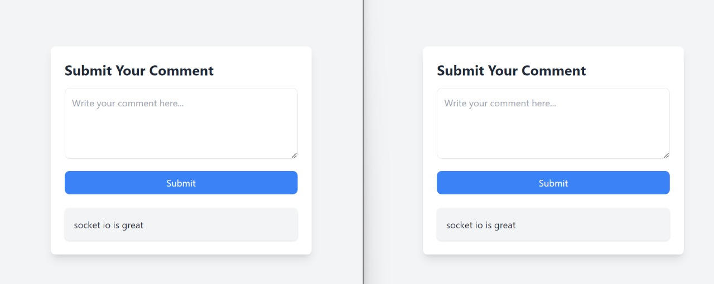

# Real-Time Commenting System

A simple real-time commenting system using **Socket.IO** and vanilla JavaScript to broadcast and display comments in real-time.

## Features
- Real-time comment updates for all connected users
- Dynamic comment cards creation using JavaScript
- Clean and minimal UI with Tailwind CSS styling